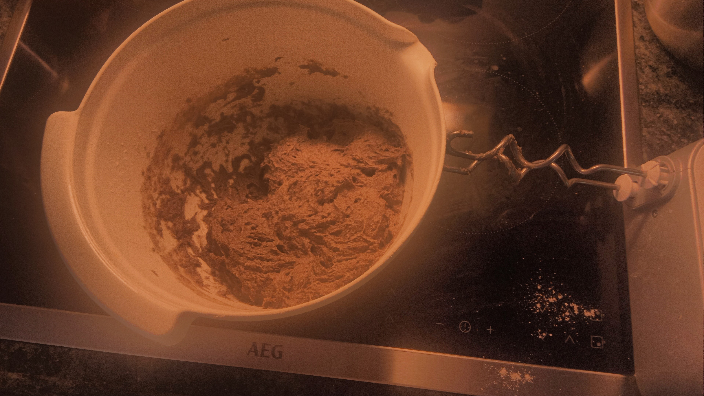
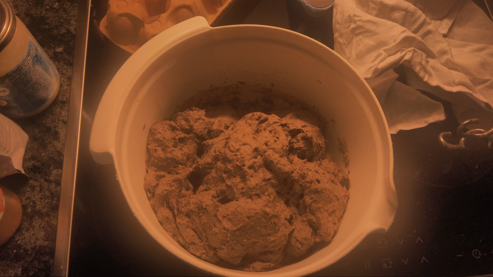
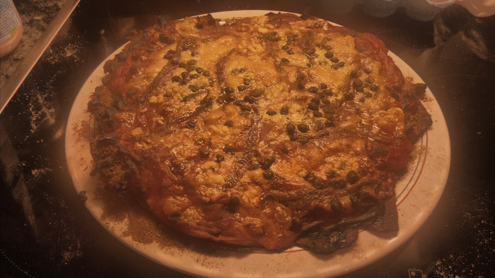

**Gluten-Free Whole Wheat-Style Pizza Dough**

Tried out the following recipe. Results: 

Before rising:

After rising:

End result: 

Pros: 
* very lightweight dough
* OK taste, resembling whole wheat bread
* Very easy to cut, but doesn't crumble

Cons: 
* Too sticky to handle properly

Next iteration: 
* Less water = less sticky? 

Ingredients for flour blend:

* 1/2 cup (60g) brown rice flour (bruine rijstmeel / farine de riz brun)
* 1/4 cup (30g) sorghum flour (sorghummeel / farine de sorgho)
* 1/4 cup (30g) millet flour (gierstmeel / farine de millet)
* 1/4 cup (30g) teff flour (teffmeel / farine de teff)
* 1/4 cup (30g) tapioca starch (tapiocazetmeel / amidon de tapioca)
* 2 tbsp (15g) potato starch (aardappelzetmeel / fécule de pomme de terre)
* 1 egg
* 1 tsp xanthan gum (xanthaangom / gomme xanthane)
* 1 tsp salt (zout / sel)
* 1 tsp sugar (suiker / sucre)

Additional ingredients:

* 2 tsp active dry yeast (actieve droge gist / levure sèche active)
* 1 cup (240ml) warm water (warm water / eau tiède)
* 2 tbsp olive oil, the heat resistant type for cooking (olijfolie / huile d'olive)
* 1 tbsp apple cider vinegar (appelciderazijn / vinaigre de cidre)

Instructions:

1. In a large bowl, mix all the flour blend ingredients: brown rice flour, sorghum flour, millet flour, teff flour, tapioca starch, potato starch, xanthan gum and salt.
3. In a small bowl, combine warm water, sugar, and yeast. Let it sit for 5 minutes until foamy.
4. Add the yeast mixture, egg, olive oil, and apple cider vinegar to the dry ingredients. Mix well until a sticky dough forms.
5. Cover the bowl and let the dough rest in a warm place for 1 hour.
6. Preheat your oven to its highest setting (max 275°C).
7. Place a pizza stone or inverted baking sheet in the oven while it preheats.
8. Roll out the dough between two pieces of parchment paper to about 1/4 inch thickness.
9. Remove the top parchment and transfer the dough (still on the bottom parchment) onto the hot pizza stone or baking sheet.
10. Par-bake the crust for 8-10 minutes until it starts to firm up and lightly brown.
11. Add your desired toppings and bake for an additional 8-10 minutes until the cheese is melted and the crust is golden brown.

This recipe will yield one pizza crust. The combination of whole grain gluten-free flours mimics the taste and texture of whole wheat, while the starches help bind the dough. The apple cider vinegar helps to tenderize the crust and provides a slight tanginess often present in wheat-based doughs.

Remember, this gluten-free dough will be stickier and less elastic than wheat-based dough, but it should produce a tasty, whole wheat-like pizza crust. Adjust water as needed if the dough seems too dry or too wet.
